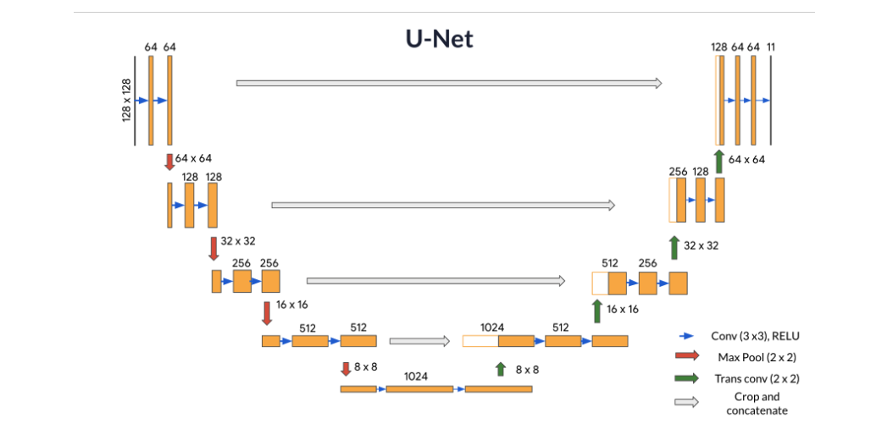

# Semantic Segmentation with U-Net

### This directory contains implementation of Semantic Segmentation using U-Net.

## `Structure of the directory:`
  * `data*/` -> Directories with different datasets.
  * `unet.py` -> The U-Net Architecture implementation based on Paperworks/U-Net.pdf architecture.
  * `predict.py` -> Testing U-Net on [Kaggle](https://www.kaggle.com/datasets/kumaresanmanickavelu/lyft-udacity-challenge/data) Semantic Segmentation with 23 convolutional layers and 23 possible labels for each pixel getting 80% accuracy (~45' training).

# U-Net Architechture

**NOTE: For more details about implementation check comments.**

Copyright 2024 Vasile Alexandru-Gabriel (vasilealexandru37@gmail.com)