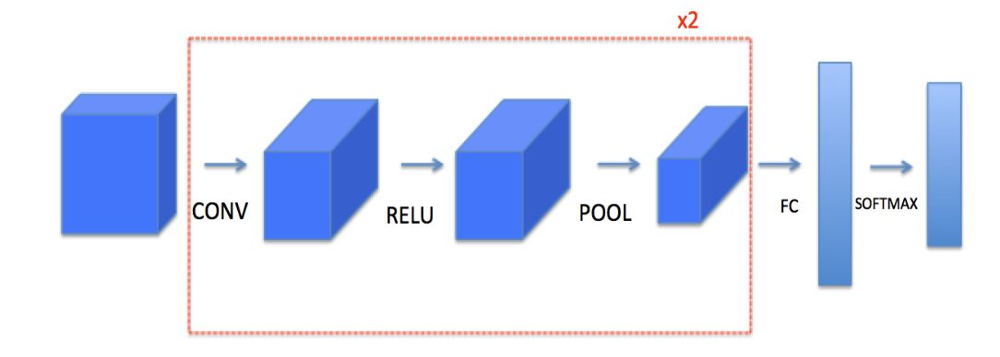

# Convolutional Neural Network

### This directory contains the implementation of several convolutional neural networks.

## `Structure of the directory:`
  * `trainingsample/` -> Directory with datasets used in the applications.
  * `cnn_happydataset.py` -> Implementation with 85%(97% train) accuracy on [Kaggle](https://www.kaggle.com/datasets/iarunava/happy-house-dataset/code) dataset using TF Keras' Sequential API.
  * `cnn_scratch.py` -> Scratch generic implementation of a CNN.
  * `cnn_signs.py` -> Implementation with 94%(90% train) accuracy on [Kaggle](https://www.kaggle.com/code/ayanmaity/hand-sign-resnet/input?select=test_signs.h5) dataset using TF Keras' Functional API.

# Architechture used for SIGNS dataset.

**NOTE: For more details about implementation check comments.**

Copyright 2024 Vasile Alexandru-Gabriel (vasilealexandru37@gmail.com)