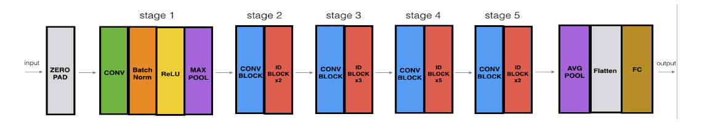

# Residual Neural Network

### This directory contains the implementation of Paperworks/Residual-NeuralNetwork.pdf using 50 layers.

## `Structure of the directory:`
  * `residualnetwork.py` -> Implementation of the convolutional and identity blocks.
  * `test.py` -> Testing ResNet on [Kaggle](https://www.kaggle.com/code/ayanmaity/hand-sign-resnet/input?select=test_signs.h5) using 50 layers getting 96% accuracy on training set and 80% accuracy on test set + test on my hand (!different distribution!).

# Architechture used for SIGNS dataset.

**NOTE: For more details about implementation check comments.**

Copyright 2024 Vasile Alexandru-Gabriel (vasilealexandru37@gmail.com)