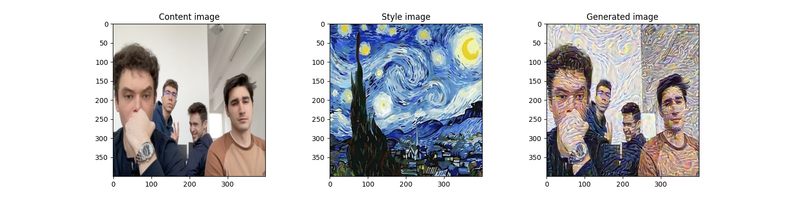
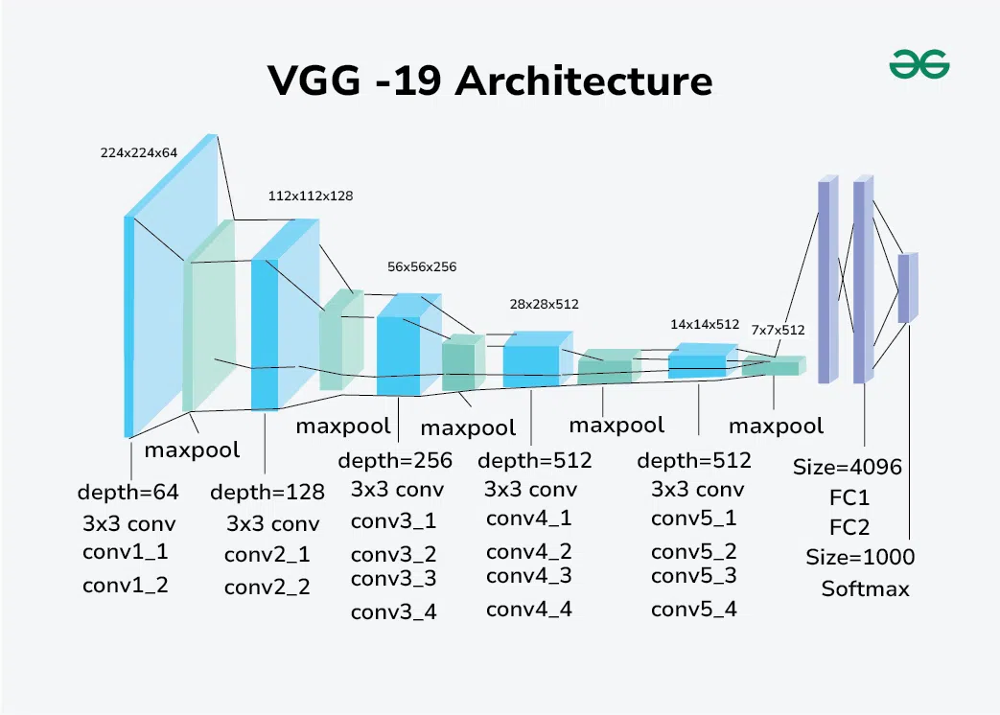

# Art Generation with Neural Style Transfer

### This directory contains the implementation of Neural Style Transfer using pretrained VGG-19 architecture.

## `Structure of the directory:`
  * `images/` -> Directory with some images for content and style.
  * `app.py` -> Implementation for the Art Generation using VGG-19 and Paperworks/NeuralStyleTransfer.jpg. 
  * To test your own images, check first 2 lines of the main function.

# Results after 1000 epochs (~10 minutes) 

# VGG-19 architecture used (without last three layers)

**NOTE: For more details about implementation check comments.**

Copyright 2024 Vasile Alexandru-Gabriel (vasilealexandru37@gmail.com)