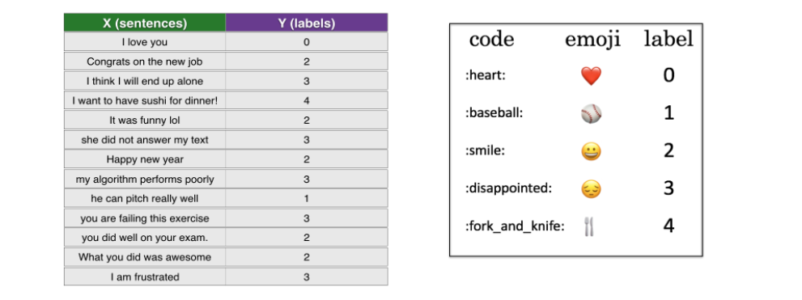
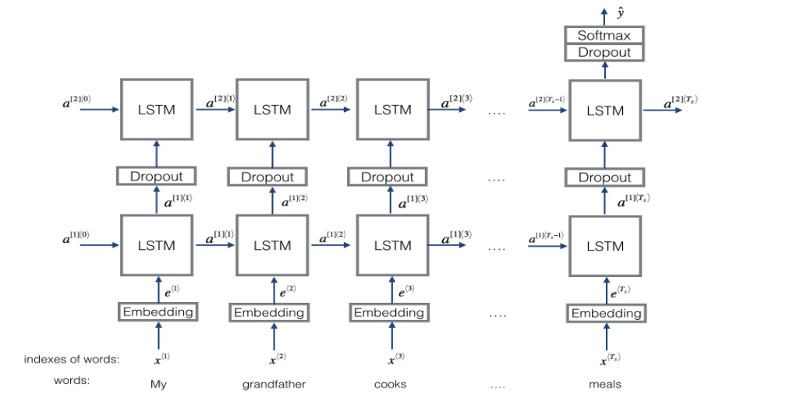
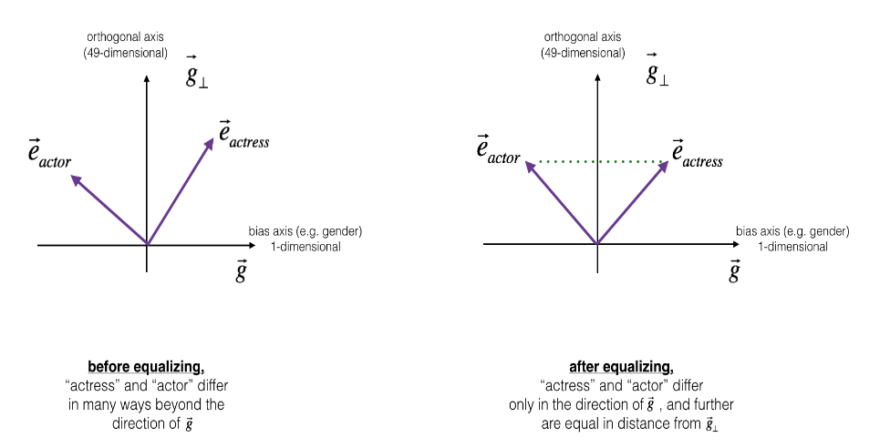
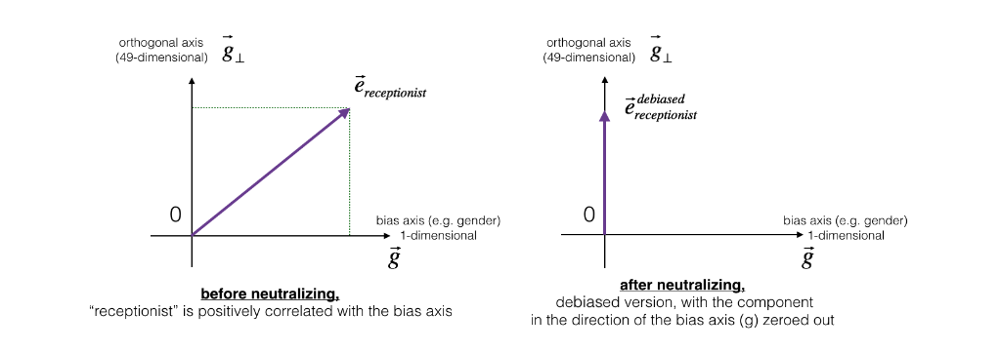

#  Emojifier + Debiasing word embeddings

### This directory contains implementation of an Emojifier app and details about word representations.

**NOTE: Because word embeddings are very computationally expensive to train I used pre-trained 50-dimensional GloVe vectors to represent words.**

## `Structure of the directory:`
  * `data/` -> Directories with the pre-trained word representation and emojifier dataset.
  * `operations.ipynb` -> Jupiter Notebook describing some operations with the word's representations + dibiasing techniques.
  * `emojify.py` -> Emojifier app that, for an input sentence, finds the most appropiate emoji to be used in the sentence.

**TODO: unzip the glove.zip (it contains the word representations used).**

### How the dataset looks for emojifier training + model used (RNN with LSTM blocks)

### Equalizaton and neutralization methods visualization

**NOTE: For more details about implementation check comments.**

Copyright 2024 Vasile Alexandru-Gabriel (vasilealexandru37@gmail.com)
